# Hello

- This is my process of learning how do graphics work!
- I am going to follow the Udemy course by -----, and the youtuber Cherno

- I hope I can learn this, and enjoy this harsh journey


# Lessons

# General Ideas

- **not a library** but a specification, there is no **code** only functions that one can use
- No need to download anything, the implementation of the openGl is made by **graphics cards** manufacture
- This is the reason why games (for example) may look different in different graphics
- Kinda of cross platform - not necessarily better for that reason
- OpenGl its the easiest API to learn  - not as low level
- There is modern and 

# The resources used

## Glew

The main Extension Wrangler

- OpenGL Extension Wrangler 
- Interface for OpenGL versions above 1.1
- The builtin libraries only allow for below 1.1
- Modern OpenGL is considered to be above 3. something
- Glew can detect whether a specific extension exist on the platform 
- Alternatives are: GL3w, glLoadGen, glad, glsdk, Glee, libepoxy ... 

### Usage

- use **#include<GL/glew.h>**
- initialize OpenGl context
- enable **glewExperimental** using **enums like** GL_TRUE
- initialize with **glewinit()**
- Check if there is errors with **GLEW_OK**
- read errors with **glewGetErrorString(result)**

## GLFW

Library to handle windows and create OpenGL context.

- Window creation and control
- process input from different sources
- allows **multiple** monitor support

## SDL

Super popular and similar to GLFW but with more functionalities (audio, threading, filesystems)

## Alternatifve

- SFML (simple and fast multimedia library) - even more features than SDL. Week OpenGl context
- GLUT (OpenGL Utility Toolkit) - no longer maintained. AVOID IT! ahahah
- Win32 API - for the purists. Lowest level for window creation 

# Shaders and the rendering Pipeline

  **Rendering Pipeline**

- series of stages that take place in order to render an image to the screen
- Fours stages are programmable via "Shaders"

  **Shaders**
- Pieces of code written in either GLSL (OPENGL Shading Language) or **HLSL** (HIgh-level Shading Language) if using Direct3D
- GLSL is based on C

## Pipeline Stages

1. Vertex Specification
2. Vertex Shader - Prog.
3. Tessellation - Prog.
4. Geometry Shader - Prog.
5. Vertex Post-Processing
6. Primitive Assembly
7. Rasterization 
8. Fragment Shader - Prog.
9. Per-Sample Operations

### Vertex Specification

- Settings up the data of the vertices of the primitives to render
- Vertex != position, is just a point of the geometry because it can contain more data. Each type of data is called an **attribute**
- **primitive** is a simple shape made using one or more vertices
- triangles most common, but also points, lines and quads. 
- Step done in the application itself

#### Used structures VAOs, VBOs and IBO 

- **VAO** -> Vertex Array Objects -> defines what data vertex has (position, colour, texture, normal etc...)
- **VBO** -> Vertex Buffer Objects -> defines the data itself
- **IBO** -> Index/Element Buffer Objects ->  allows the program to reuse existing vertices (no need to repeat info in the VBO)

All of this gets stored in the RAM of the GPU to improve performance

- **attribute pointers** where and how shaders can acess vertex data, actually connect those structures to the shaders

##### The steps for creation

- Generate a VAO ID
- Bind the VAO with that ID
- Generate a VBO ID (```glGenBuffers(1, &bufferId)```)
- Bind the VBO with that ID (automatically attaches VBO and VAO previously created - indentation in code for clearness) (```glBindBuffer(GL_ARRAY_BUFFER, bufferId)```)
- Attach the vertex data to that VBO (```glBufferData(GL_ARRAY_BUFFER, size, data, typeUsage(GL_STATIC_DRAW))```)
- Define the Attribute Pointer formatting (How is the data formatted inside the VBO ? groups of 3 | spaced appart| float | integers??) (can be done before or after data being assigned, just needs to be after the binding)
  - ```glVertexAttribPointer(index, size, type, normalized, stride, pointer)```
    - **stride** - size of each vertex
    - **pointer** - offset in bytes of the attribute from the beggining of the vertex info
- Enable Attribute Pointer (Can be done before or after)(```glEnableVertexAttribArray()```)
- Unbind the VAO and VBO, ready to the next object to be bound

If using index buffer there some additional steps that allow the creation of such a object

- Generate a IBO ID (```glGenBuffers(1, &iboId)```)
- Bind the IBO with that ID (```glBindBuffer(GL_ELEMENT_ARRAY_BUFFER, iboId)```)
- Attach the indices data to that IBO (```glBufferData(GL_ELEMENT_ARRAY_BUFFER, size [in bytes of the indices array], indices, typeUsage(GL_STATIC_DRAW))```)

##### Initiate the draw

The process can **vary** if one is **using IBO or not**

1. Activate Shader Program you want to use - Predefined code/compiled in a different file
2. Bind VAO of object you want to draw

If **not using IBO**:

3. Call glDrawArrays, which initiates the rest of the pipeline

If **using IBO**:

3. Call ```glDrawElements(GL_TRIANGLES, numberOfIndices in indices array, typeOfData, nullptr)```

### Vertex Shader

- **NOT OPTIONAL**
- Handles vertices **individually** (possible change vertices using matrixes, offset them etc...)
- Shader gets called **for each** vertex to define their position (main purpose)
- Must store something in **gl_Position** as it is used by later stages (where final vertice position is defined)
- Can specify additional outputs that can be picked up and used by user_defined shaders later in the pipeline (pass colours or other attributes)
- Inputs consist of the vertex data itself
- Attribute is acessed via its index

Simple example:
```c++
#version 330

layout (location=0) in vec30 pos;

void main()
{
    gl_Position = vec4(pos, 1.0);
}
```
- Define version of GLSL now syncronises with OPENGL version

### Tesselation

- Only appeard in OpenGl 4
- Allows you to divide data in to smaller primites (ex. quads -> triangles)
- Can be used to add higher levels of detail dynamically (ex. when you get closer to something. Used in water)

### Geometry Shader

- handles primitives (groups of vertices) [recall, VertexShader handles vertices]
- takes primitives then emits their vertices to create the given primitive, or even new primitive
- Can alter data given to it to modify given primitives, or even create new ones
- Can even alter the primitive types (points, line, triangles, etc) - take one type ouput another

### Vertex Post-Processing

Sometimes stages are considered different ones

**Transform Feedback** (if enabled):
- Result of Vertex and Geometry stages saved to buffers for later use
- Instead of going through all the Vertex Geometry stages every single time, if saved, those steps can be skiped
- For heavly defined programs
**Clipping**:
- Primitives that won't be visible are removed
- Positions converted from "clip-space" to "window-space"

### Primitive Assembly

- Mathematically define everything as a primitive
- Vertices are converted in to a series of primitives (ex. rendering triangles, 6 vertices would become 2 triangles, 3 vertices each)
- **Face culling** - the removal of primitives that can't be seen, or are facing "away" from the viewer

### Rasterization

- Converts primitives into "Fragments"
Fragments - pieces of data for each pixel, obtained from the rasterization process
- Fragment data will be interpolated based on its position relative to each vertex

### Fragment Shader - pixel shaders

- Optional but its rare not being used - Exceptions are cases when only depth or stencil data is required (ex. shadow maps)
- Its called for each pixel/fragment of the screen
- Handles data for each fragment
- Most important output is the color of the pixel that the fragment covers
- Handles all the light, textures and shadows

Simple example
```c++
#version 330

out vec4 colour;
void main()
{
    colour = vec4(1.0, 0.0, 0.0, 1.0);
}
```
- Version needs to match the OpenGL and other shaders version
- Full read colour in this case
- No need to be called exactly colour
- **in** catches output from **Vertex Shader**

### Per-sample Operations

- Series of test runs to see if the fragment should be drawn
- **Depth test** - most important test. Determines if something is in front of the point being drawn
- **Coloud Bending** - using defined operations, fragment colours are "blended" together with overlapping fragments. Usually used to handle transparent objects
- Fragment data written to currently **bound Framebuffer** (usually the default buffer) - possible to draw to a new buffer, besides the two normal buffers
- Lastly, buffer swap in the application


**PIPELINE is OVER!**

## On the origin of shaders

- Shader is just a program that runs on the GPU
- Shader Programs are a group of shaders associated with one another
- Created in OPENGL via a series of functions.

## Creating a Shader Program

1. Create empty program (```uint program = glCreateProgram()```)
2. Create empty shaders (```uint id = glCreateShader(GL_TYPE_SHADER)```)
3. Attach shader source to shaders (```glShaderSource(id, 1 (amount of sources codes), &source, nullptr [length])```)
4. Compile shaders (```glCompileShader(id)```)
5. Error handling (sintax errors verification) (```glGetShaderiv(id, GL_COMPILE_STATUS, &result)```)
  - Returns to result if there was an error
  - Get length of the error (```glGetShaderiv(id, GL_INFO_LOG_LENGTH, &length)```)
  - Can use **alloca** in order to create char array with specific size
  - Get the actual log (```glGetShaderInfoLog(id, length [max length of the buffer], nullptr [returns length of the message], messageBuffer)```)
6. Attach shaders to program (```glAttachError(program, shader)```)
7. Link program (creates executables from shaders and link them together) (```glLinkProgram(program)```)
8. Validate the Linking (similar to sintax shader verification) (```glGetProgramiv(program, GL_LINK_STATUS, &result)```)
9.  Validate program (optional but highly advised because debugging shaders is a pain) (```glValidateProgram(program)```)
10. Validate the validation of the program (similar to validating linking)
11. Can delete each individual shader, the intermidiate files (```glDeleteShader(shader)```)
12. May have to detach shader (```glDetachShader(program, shader)```) - can delete info necessary to debug

## Loading shaders

The different shaders are loaded into GLEW, as we saw, via a strings that contain the source code. 
One might write the shader code in the same file or do it in a different file or location and then load it, making use of the C++ fstream logic.


## Using a shader program 

- When you create a shader, an ID is given (like with VAOs and VBOs)
- Simply call **glUseProgram(shaderID)**
- All draw calls from then on will use that shader
- shaderID 0 means no shader

## Summary

- Rendering Pipeline consist of several stages
- Four stages are programmable via shaders (Vertex, Tessellation, Geometry, Fragment)
- Vertex Shader is mandatory
- Vertices: User-defined points in space
- Primitives: Groups of vertices that make a simple shape (usually a triangle)
- Fragments: Per-pixel data created from primitives
- Vertex Array Object (VAO): WHAT data a vertex hax
- Vertex Buffer Object (VBO): The vertex data itself
- Shader programs are created with at least a Vertex Shader and then activated before use

# Dealing with errors!

## No external Tools

- **glGetError()** - has been in OpenGl since the beginning (compatible with all version)
  - Every time an OpenGl functions runs and an error occurs a flag gets set internally in OpenGl insides. 
  - When we call this function we are basically just getting the flags, one at a time
  - One would need to first clear all errors, execute a function and then check for errors again!
- **glDebugMessageCallBack** - newer way of dealing with errors
  - Allows user to specify function pointer that gets executed when an errors occurs
  - Explains also what was the exact error and suggest how to fix it


# Uniforms

A way of passing information from CPU to GPU (shaders) as if declaring a variable. 

- Uniforms are set per draw, attributes are set per vertex
- Uniforms must be defined in the shader code (ex. fragment shader)
```glsl
#version 330 core

layout(location = 0) out vec4 color;

uniform vec4 u_Color

void main(){
  color = u_Color;
}
```
- In order to define the variable in CPU side, need to pay attention to **name** and **type** of the variable in question
- The definition of type needs to be done after shader being bound, called ````glUseProgram```
- After shader is created an **ID** is assigned to each uniform
- Get that location by using ```int location = glGetUniformLocation(program, variableName)```
- Location can be -1 if OpenGl didn't find it in the specified program (uniform must be used in the shader not only declared)
- Make use of the functions ```glUniform[type](location, values...)```

### Types

glUniform...:

- 1f - single floating value
- 1i - single integer value
- 4f - vec4 floating values
- 4fv - same as above but value specified by pointer
- Matrix4fv - mat4 of floating values, specified by pointer

# Interpolation

- Used for quickly estimate values without needing to define them
- Sometimes Per-Vertex attributes are **interpolated**, meaning that the values between those vertices are discovered by a **weighted average**.
- Fragment Shader picks that interpolated value and uses it

Uses:

- Texture Coordinates when mapping textures (only need to define corners and the rest gets mapped)
- Normal Vectors when handling lighting 
- Useful in Phong Shading to create the illusion of smooth/round surfaces


# Abstraction
Reasons for abstraction:

- Change names, keep consistency with a simple wrap up 

There's a need to do some abstraction to improve readability

- Vertex Buffer 
- Index Buffer
- Vertex Array (if using or not)
- Rendered (what tights everything together) - works by commanding it to draw something
  - It's responsible for the draw call (it could be thighed to individual index buffers)
  - Center pipeline
- Shaders 
  
An error can occur when program tries to destroy Vertex and Index buffer but doing so after glfwTerminate was called. This function destroys the OPENGl context, which GlGetError detects as an error. Fixing this is as simple as destroying those structures before calling that function, by creating a scope or dynamically allocating in the heap.

# Textures

- Common sense: have an image on some kind of surface
- Images used to add detail to object
- Usually 2D but can be 1D or even 3D
- Points on textures are called **texels** ( defined between 0 and 1, kinda percentage), not pixels
- But they can be much more!!! Image that can be used when rendering something, with much power! (ex. normal maps)
- The beginning would just be getting an image from computer into a surface in the application!
- **Texturer.com** is a great place to get them

## Samplers

- Textures are accessed via **Samplers**
- Texture are stored in **slots/texture Unit**. 
- The **number of slots** depends on the GPU. Its possible to ask OpenGL how many are available
- To get **value of texel** use "texture" function ```texture(textureSampler, TexCoord)```
- To define which **slot to bind** ```glActiveTexture(GL_TEXTURE(num))```
- To bind do ```glBindTexture([type](GL_TEXTURE_2D), id)```


## Texels

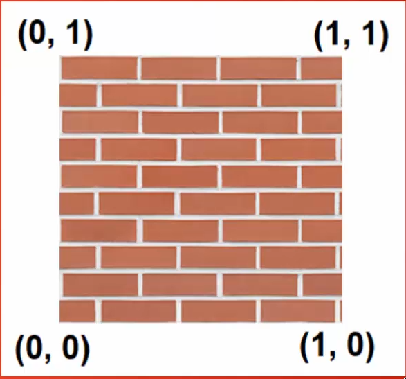

- Map texels to vertices
- Interpolation over each fragment will calculate appropriate texels in between the assigned ones

## Implementation 

1. Load image into CPU (game engines usually have specific image extensions) - using PNG
2. Use a library to get the info from image (give filePath - receive buffer of pixel colors)
3. **Invert** the image so that pixels start from the **bottom left** corner (How OpenGl expects)
4. Upload the pixel color buffer to GPU (create texture in OpenGL via ```glGenTextures([number of textures], &id)```)
5. Bind texture when rendering (```glBindTextures([type](2d, 3d?), id)```)
6. Setup texture settings (```glTexParameter(type of data) ([type], [parameter], [type of resampling??])```)
  - There are 4 **necessary parameters to be defined**
  - GL_TEXTURE_MIN_FILTER ( how it gets scaled down)
  - GL_TEXTURE_MAG_FILTER ( how it gets scaled up)
  - GL_TEXTURE_WRAP_S ( how wrap in x ...)
  - GL_TEXTURE_WRAP_T ( how wrap in y...)
7. Pass the data to OpenGl texture (```glTexImage2d(id, Mipmap level, format to store(ex. rgb, rgba), width, height, 0 (legacy stuff regarding borders), format to read, data type of values, data itself)```)
8. Modify fragment(pixel)shader to read texture 
  - Shader **reads** from **integer uniform** which **slot (sampler slot)** is the texture in so we can sample from there

### Mipmaps

- Resolution limitation for textures
- Closer -> more pixelated | Away -> multiple texels to same pixel
- Solution!!! Create multiple versions of the texture at different resolutions and switch them based on distance

### Texture parameters (already seen in implementation)

What would happen if trying to render off center of texels??

- **Nearest**: Use the texel with most overlap ( creates pixelated effect )
- **Linear**: Use a weighted average of surrounding texels ( blend pixel boundaries )
- Latter is more common

What if trying to sample a point outside the [0, 1] range?

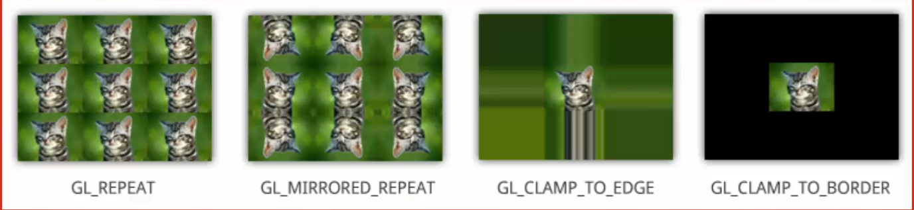

- Repeat the texture - ```GL_REPEAT```
- Repeat a mirrored form of the texture ```GL_MIRRORED_REPEAT```
- Extend pixels at the edge ```GL_CLAMP_TO_EDGE```
- Apply a colored border ```GL_CLAMP_TO_BORDER```


# Projections

- Convert from **View Space** to **Clip Space**
- Used to give a 3D look
- Or create a 2D style for projects that require it
- Fundamental coordinate systems are understood

## Coordinate systems

- **Local Space** - Raw position of each vertex drawn relative to the origin. Multiply by **Model Matrix** to get...
- **World Space** - Position of the vertex **in the world** itself if **camera assumed** to be at the **origin**. Multiply by **View Matrix** to get...
- **View Space** - Position of vertex **in the world** relative to the **camera position and orientation**. Multiply by **projection Matrix** to get...
- **Clip Space** - ... as **viewed in the area** not to be "clipped" from the final output
- **Screen space** - after clipping, final image is created and placed on the window after **ViewPort transformation**

**Order matters!!! projection * view * model * LocalSpace**

## Projections

- In order to create the **Clip Space** an **area (frustum)** of what is not to be clipped **needs** to be defined with a Projection Matrix
- There are two main types of Projection

### Orthographic (most common on 2D apps)

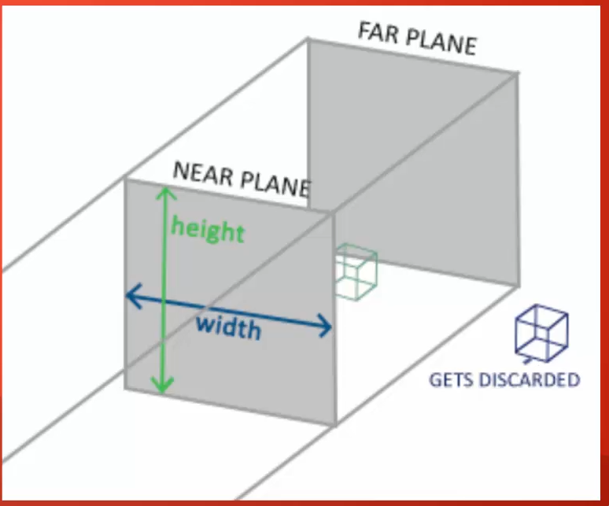

- Frustum is **cuboid**
- Everything between Far and Near plane is kept, everything else is discarded
- 3D depth is not visible
- Object moving closer/further won't affect its size

### Perspective (most common on 3D apps)

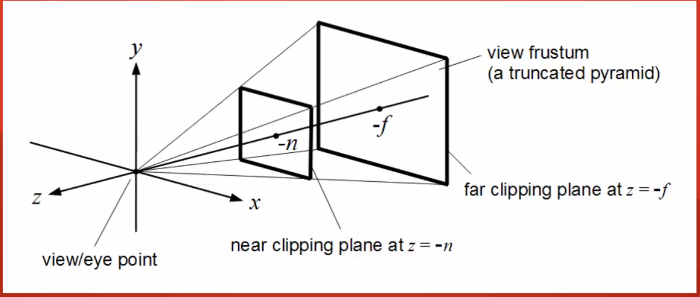

- Frustum is a **truncated pyramid**
- Each pixel on the Near Plane at an angle to reach matching point on Far plane
- Gives the illusion of depth
- The more an object gets closer to the near plane, the more lines it intercepts, getting bigger

### Comparison

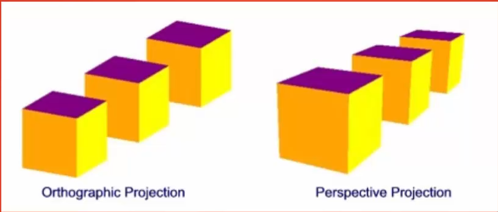

- **Orthographic**: The one furthest back looks to be the same size as the one in front, implying its larger 
- **Perspective**: The one in the back look smaller than the one at the front, due to being more distant, as it should

## Projection with GLM and OpenGL

- glm::mat4 proj = glm::perspective(fov, aspect, near, far);
- **fov**: field-of-view, the angle of frustum
- **aspect**: aspect ratio of the viewport (usually **width/height**)
- **near**: distance of the near plane
- **far**: distance of the far plane
- Bind the given matrix to an uniform
- gl_Position = projection * view * model * vec4(pos, 1.0f);


# Camera

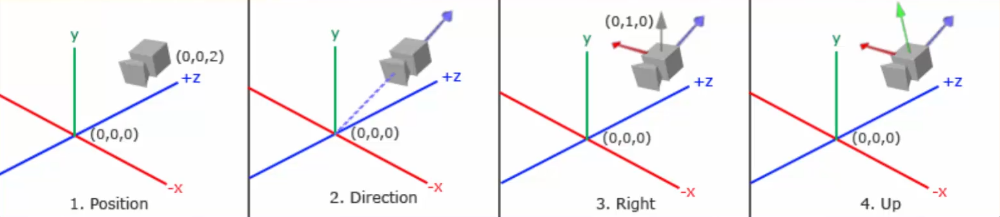

- Processes the scene as seen in **View Space** (coordinate system with each vertex as seen from camera)
- View Matrix to convert World Space into View Space
- View Matrix requires: Camera Position, Direction, Right(direction) and Up(direction)
  - Direction: direction that camera is looking in (opposite of the intuitive)
  - Right: defines the x-axis of the camera. Can be calculated by **cross product** between UP[0,1,0] and Direction
  - Up: can be calculated by the cross product between Direction and the Right

## Calculations of the Matrix

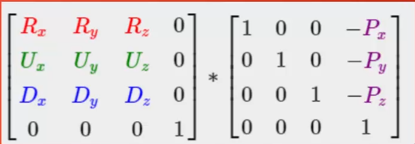

- Apply the viewMatrix to a vertex and it will be converted to View Space
- GLM has specific function for this: ```glm::mat4 viewMatrix = glm::lookAt(position, target , up);```
  - target: point to look at (can be considered as the camera position + direction)
  - up = The upwards direction of the **world**

### Moving the camera

- GLFW:glfwGetKey(window, GLFW_KEY_W) to check if a key is pressed
- Add value to camera position while key is held

##### Input: Delta Time

- Basic Idea: Check how much time passed since last loop and move based on that so speed is constant
- deltaTime = current - last;
- last = current
- multiply movement speed by deltaTime
  
### Turning

- Pitch: looking up and down - needs to rotate view up and down using axis relative to yaw
- Yaw: looking left and right - only rotates us around the y-axis
- Roll: like a plane doing a barrel roll

#### Pitch
- X = sin(pitch)
- y = cos(pitch)
- z = cos(pitch)

#### Yaw
- x = cos(yaw)
- y = sin(yaw)

#### Final


# Lighting 

## Phong lighting/Reflection
 
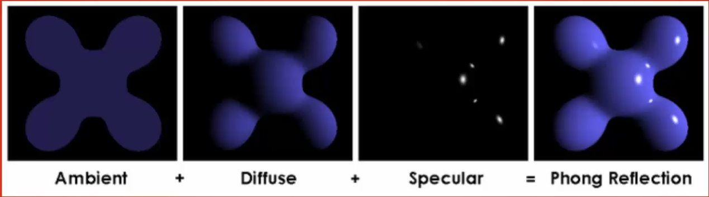


- **Ambient lighting**: light that is always present, even if direct source's path is blocked
- **Diffuse lighting**: light determined by the direction of light source. Creates a faded effect further from the light
- **Specular lighting**: light reflected perfectly from the source to viewer's eye, (reflection of the light source). More prominent on shiny objects

All this combined create the **"Phong Lighting Model"**!


## Ambient lighting

- Simulates light bouncing off other objects
- Ex. Create a shadow with your hand. The shadow still has color!! 
- Global illumination (another very advanced lighting model) actually simulates this behavior

### Creation 

- Define an ambient lighting factor
- ambient = lightColor * ambientStrength
- fragColor = objectColor * ambient
- ambient = 1 -> full power. Fragment is always lit
- ambient = 0 -> no power. Fragment is always black
- ambient = 0.5 -> half power. Fragment is half its normal color

## Diffuse lighting 

- More complex :)
- Simulates the drop-off of lighting as angle of lighting becomes more shallow
- Side facing directly at a light is brightly lit
- Side facing at an angle is more dim
- Can use the angle between the vector connecting the light source to fragment and the vector perpendicular to the face (aka. normal)

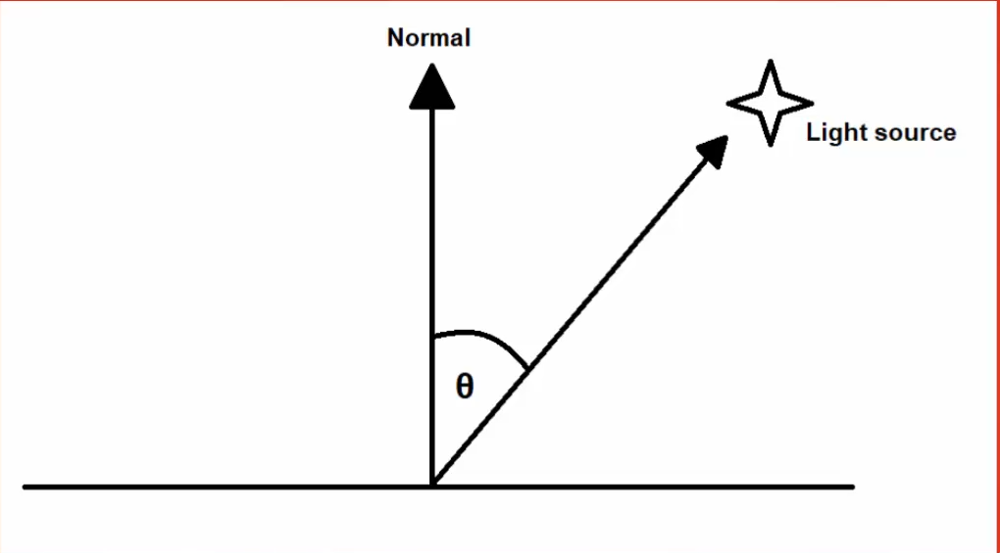

- Determine Diffuse factor with angle (o)
- smaller o: more light
- Larger o: more dim
- Calculation can be done using **dot product**: v1 * v2 = cos(ang) (if v1 and v2 are normalized)
- Because ang is [0, 90], cos(ang) would be [0, 1] making this exactly what we want
- When factor is negative then light source is behind surface so factor is 0
- In order to apply ambient + diffuse: $fragColor = objectColor * (ambient + diffuse)$

### Normals

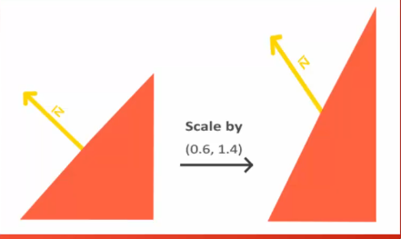

#### Defined for each face
- Each vertex would have multiple normals ( one for each face it is part of )
- Good for "Flat shading" ( objects that have sharp edges, nothing round) , not for realistic smooth lighting
- Doens't work well with indexed draws

#### Phong shading
- Each vertex has an average of the normals of all the surfaces it is part of
- Interpolate between the averages in shader to create smooth effect
- Good for complex models **but** not good for simple objects with sharp edges ( unless use some clever modelling techniques )

#### Problem!!

- When performing non-uniform scales normals are worngly transformed
- The solution is to perform a "normal matrix"

##### Explanation!

- $N \cdot T = 0$
- $N' - T' = GN \cdot MT = (GN)\intercal \times (MT) = N\intercal \times G\intercal \times M \times T = 0$
- Considering (G)t * M = I : (N)t * T = N' . T' = 0
- So: G = (M-1)t

## Specular Lighting

- Specular lighting relies on the position of the viewer
- It is the direct reflection of the light into the viewer's eye
- Moving around will affect the apparent position of the reflection on the surface
- Considering this, it's necessary:
  - Light vector
  - Normal vector
  - Reflection vector ( light vector reflected around normal )
  - View vector ( vector from viewer to fragment )

 
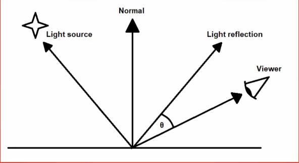

- Need the angle between the viewer and the reflection
- smaller ang = more light
- **View Vector** - difference between fragment position and the Camera position
- **Reflection** - obtained with a GLSL function ```reflect(incident, normal)``` ( need to get the formulas !!! ) 
- Use dot product to get angle between normalized view and reflection to get the specular factor

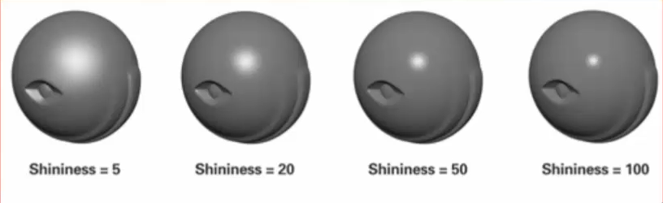

### Shininess

- value to alter behaviour of reflection and make it more accurate
- Bigger shine = smaller and compact specular
- specularFactor = (view * reflection)^shininess

To apply just do : fragColor = objectColor * (ambient + diffuse + specular)

## Directional Lighting


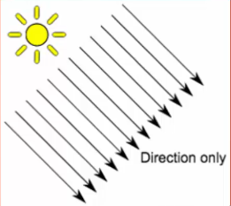

- Simplest form of light
- Without a position source, coming as parallel rays from a infinite distance
- Only requires basic information ( color, ambient, diffuse, specular ) + direction
- Use the same **direction** vector for all the light calculations
- Example: Sun

## Point light

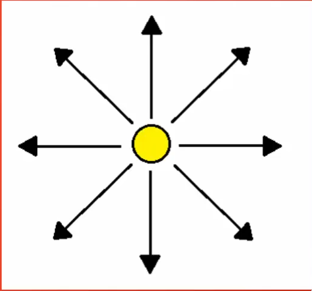

- A light with a position that shines in all directions
- Example: lighBulb
- There's a need to calculate manually the direction vector ( light position - frag position)
- After getting the direction use the same logic as directional lighting
- It's possible to describe the change using 1/(ax²+bx+c) - being x the distance to the light

### Attenuation

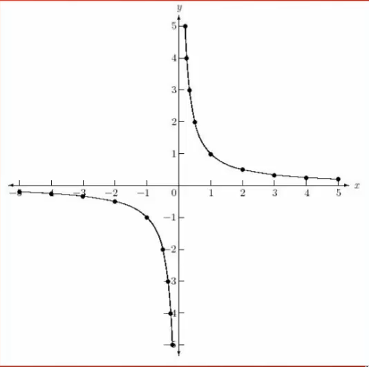

- Distance between light source and point being lit influence the power of lighting
- Easy solution: Linear drop-off ( not realistic )
- In reality, light intensity initially drops quickly with distance

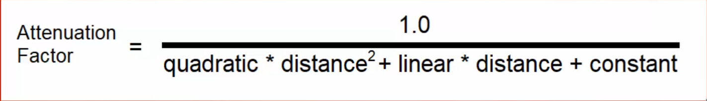

- **quadratic**: user defined value - usually the lowest of the three
- **linear**k: user defined value - lower than constant
- **constant**: usually 1.0 to ensure denominator is always greater than 1
- See useful values [here](https://wiki.ogre3d.org/tiki-index.php?page=-Point+Light+Attenuation)
- **APPLICATION** -- apply the attenuation to ambient, diffuse and specular!

## Spot light

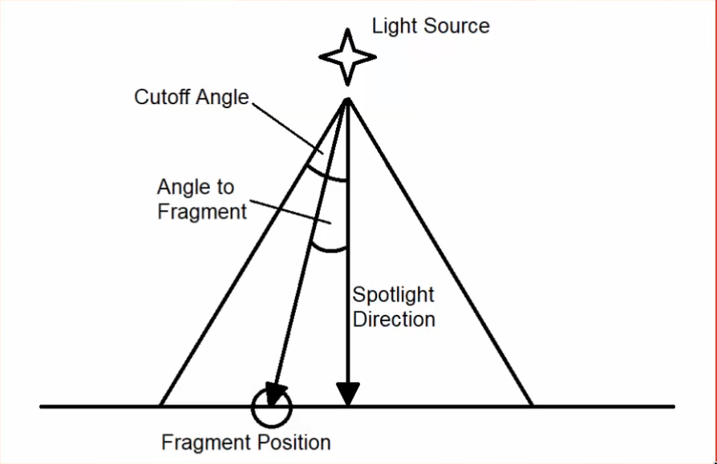

- Similar to point but emits light only within a certain range
- Example: flashLight
- **Direction** - Where the spot is facing
- **Cut-off angle** - angle that describes the "edges" of the light
- Need to compare **Angle to fragment** to **Cutoff Angle**
- **angleToFrag** - lightVector . lightDirection
- If **angleToFrag** is larger than **cos(cutOffAngle)** then apply lighting. Otherwise don't

### Edge effects

- Simple approach has sharp edges
- Creates unrealistic spot light ( might be good for some styles)
- Solution! Use the dot product from before as a factor!
- Problem: due to select range, dot product won't scale well (ex. 10degrees, cos(angle) = [0.98, 1])
- Solution! Scale dot product to the range 0 - 1


- Inverting so that range has inverse logic
- This way, maximum value 1 when angle is 0 with the direction

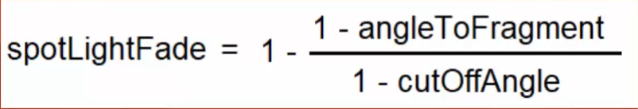

- Color = spotLightColor * spotLightFade


## Area light

- More advanced type
- Emits light from an area
- Example: large light up panel in a ceiling

# Blending

How does OpenGl handle transparency?

- **source/output** - the color we output from the fragment shader
- **target** - the buffer our fragment shader is drawing to
- Blending is the process of calculating what the output color should be !

## Controlling

- ```glEnable(GL_BLEND)``` or ```glDisable(GL_BLEND)``` to turn on/off this feature (default off)
- ```glBlendFunc(srcFactor, destFactor)``` - the factors used to multiply by the src and dest (default GL_ONE / GL_ZERO)
- ```glBlendEquation(mode)``` - how to combine the src and dest after multiplying by factor (default: GL_FUNC_ADD)
- The calculation: operationMode(srcFactor * src, destFactor * dest)
- In order to achieve a realist output use **src=GL_SRC_ALPHA** and **dest=GL_ONE_MINUS_SRC_ALPHA**
